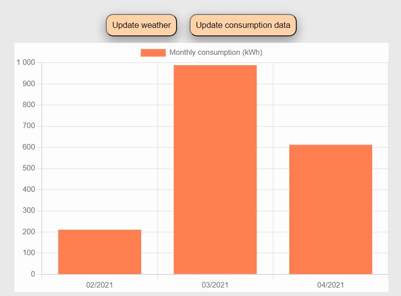
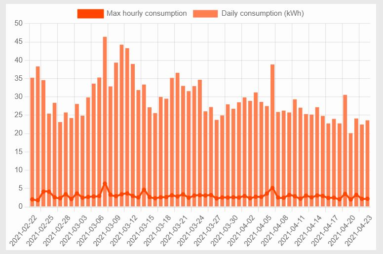
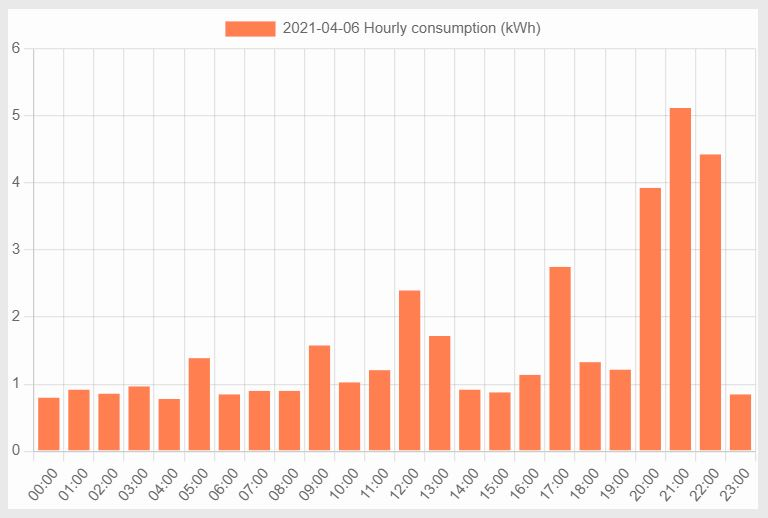
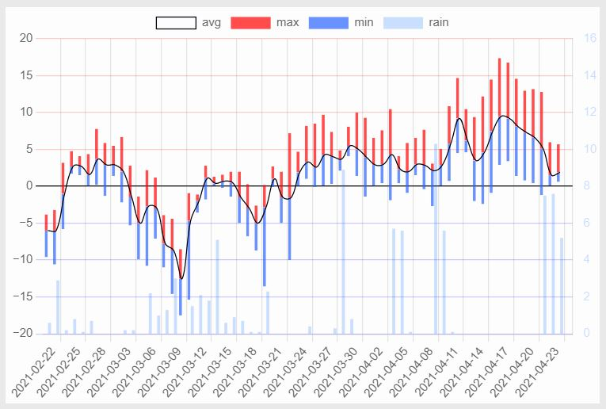
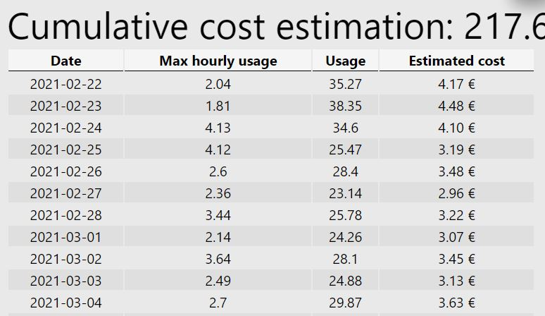

# lumofetch
Electric consumption JSON API and React UI for Lumo Energia and graphs of FMI weather data

How to use?
Create credentials.txt into src/data/ and add your Lumo Energia login info there in JSON format:
{"account":"my.email@email.com", "password": "mypassword"}

Install python requirements: beatifulsoap4 (bs4?), requests, urllib3, http.server, json
And others I forgot to mention.

Test run backend.py to see if you are missing any dependencies

Now with node and npm you can run the web server:
Run npm install and build dll if asked to.

npm start

And that should be it.

Example charts:

